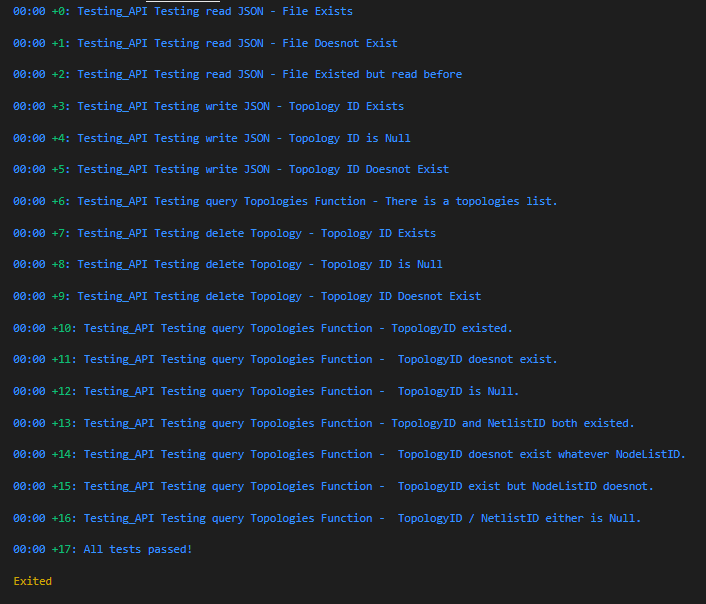

# Topology_API

An API Library for providing the functionality to access, manage and store device topologies doing the following:

1. Read and write topologies to and from disk.
2. Stores multiple topologies in memory.
3. Execute operations on topologies.

### Some Best Practicies::

+ Topology Json filename prefered to be the TopologyID ;for preventing making more than one file for each topology

## Why Dart?!

Dart is an OOP programming language developed by google and defiened by Google's Team; it is a client-optimized language for developing fast apps on any platform. Its goal is to offer the most productive programming language for multi-platform development.

But what makes it so special for me is that is is a very performant language and one of very few languages (and perhaps the only “mainstream” language) that is well suited to being compiled both AOT and JIT. Also it contains "Handshaking" feature ; which is used for removing any imports of libraries that is not used. Also behind the scences dart uses "managed pointers"; as if you used an object or a variable and made another one containing the same object/variable it doesn't create another onee it just points to the other.

Finally; it is easy to be used compared to it's performance and I used to develop using it.

## How to use the API?

1. First of all download "Dart" from here (https://dart.dev/get-dart)
2. Clone the repo and the get the dependencies using `pub get`
3. Then run the source file using `dart run`
4. To run tests use ```dart test```

### This is testcases screenshot:


